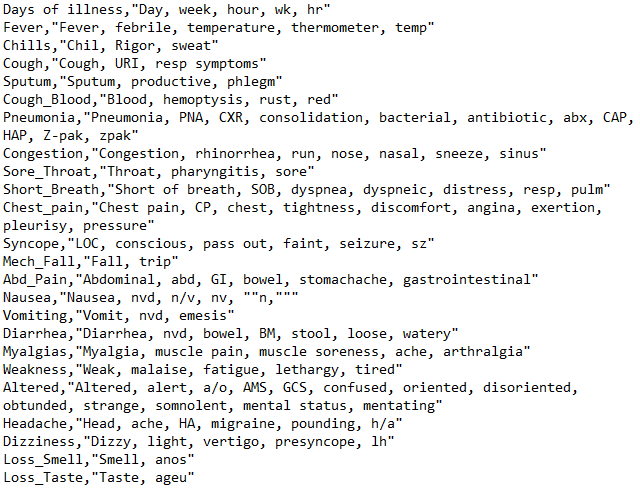
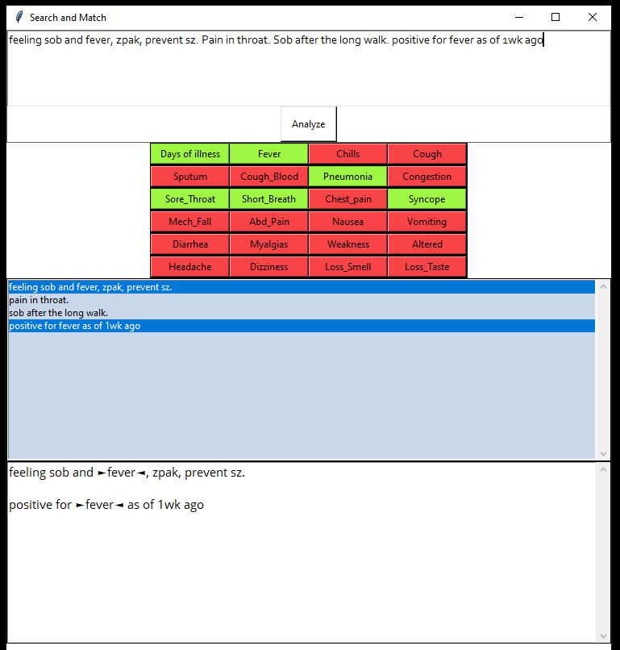

# Search Match

Search Match (SM) takes in a csv of terms and matches text. 

### The Problem:
Word processors like Word and Google Docs require a user to use complex "regular expressions" to match multiple terms at the same time.

### The Solution:
Create a CSV list of term:

Click buttons to match

- - -
###### Copyright© Shelby Thomas 2020

