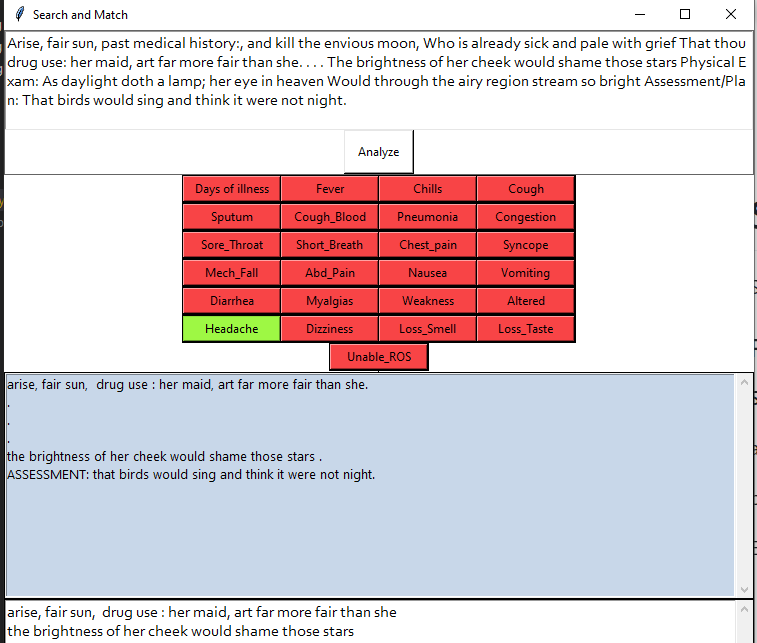

# Search Match

Search Match (SM) takes in a csv of terms and matches text. 

### Read Before Use
**SM Removes** *Past Medical History* and *Physical Exam* from text by removing everything in between:

a) *Past Medical History* and *Drug Use*

b) *Physical Exam* to *Assessment/Plan*

Example:
> Arise, fair sun, **past medical history**:, and kill the envious moon,
Who is already sick and pale with grief
That thou **drug use**: her maid, art far more fair than she. . . .
The brightness of her cheek would shame those stars
**Physical Exam**: As daylight doth a lamp; her eye in heaven
Would through the airy region stream so bright
**Assessment/Plan**: That birds would sing and think it were not night.

Turns into:

> Arise, fair sun, **drug use**: her maid, art far more fair than she. . . .
The brightness of her cheek would shame those stars
**ASSESSMENT**: That birds would sing and think it were not night.

In the future this will be configurable. For now it can be toggled on and off.

### The Problem:
Word processors like Word and Google Docs require a user to use complex "regular expressions" to match multiple terms at the same time.

### The Solution:
##### Create a CSV list of terms:

##### Enter text and click buttons to match

- - -
###### Copyright© Shelby Thomas 2020

